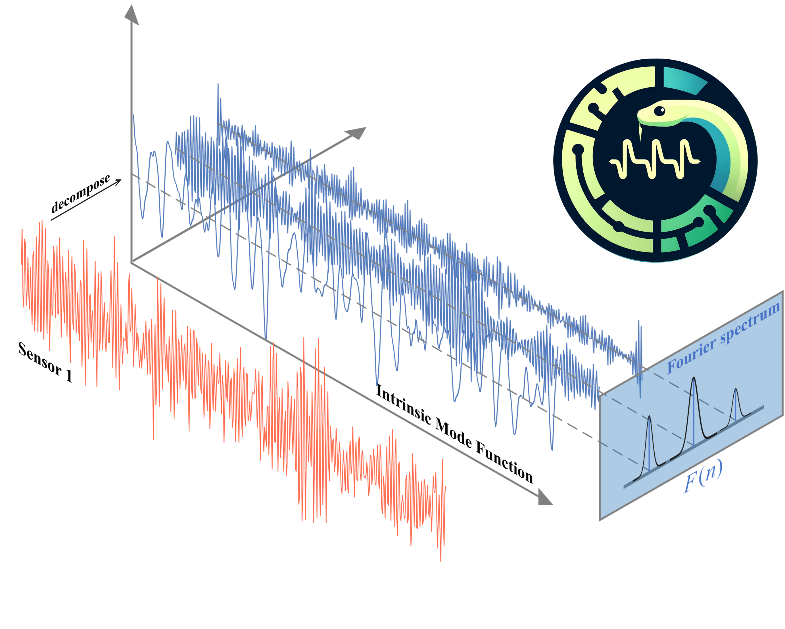

PYSDKIT's documentation
=======================

**Version**: |version|

Welcome to **PySDKit**, a Python library for **signal decomposition**,
developed with NumPy, SciPy, and Matplotlib. A non-stationary recording
is treated as a sum of simpler modes (intrinsic mode functions). Those
modes can be plotted, used as features, or fed to a downstream model,
using the same ``fit_transform`` style as scikit-learn.

Quick links
-----------

.. grid:: 1 1 2 2
   :gutter: 3

   .. grid-item-card:: :octicon:`rocket` Get started
      :link: user_guide/index
      :link-type: doc

      New to PySDKit? Install the package and learn the three-step
      ``fit_transform`` API.

   .. grid-item-card:: :octicon:`image` Examples
      :link: auto_examples/index
      :link-type: doc

      Browse the gallery of algorithm demos, figures, and downloadable
      scripts.

   .. grid-item-card:: :octicon:`repo` API reference
      :link: API/modules
      :link-type: doc

      Public classes and functions you can import from :mod:`pysdkit`.

   .. grid-item-card:: :octicon:`history` Release notes
      :link: release_notes/index
      :link-type: doc

      What changed between versions. Filled from GitHub Releases.

   .. grid-item-card:: :octicon:`tools` Contribute
      :link: development/index
      :link-type: doc

      Add an algorithm, tests, or a gallery example.

   .. grid-item-card:: :octicon:`people` About
      :link: about/index
      :link-type: doc

      Project scope, citations, and where to find the source.

.. toctree::
   :hidden:

   user_guide/index
   auto_examples/index
   API/modules
   release_notes/index
   development/index
   about/index
